# 🚀✨ Space Runner Game ✨🚀  

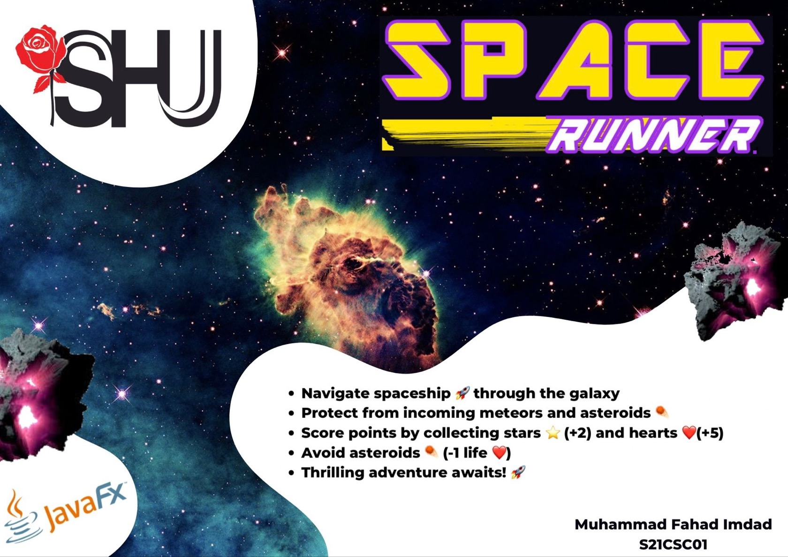  

The **Space Runner Game** is an exciting 2D Java game where you navigate a spaceship through a galaxy full of meteors and asteroids! Collect stars and hearts to boost your score, but beware—asteroids will cost you lives! Perfect for players of all ages looking for a fun, action-packed adventure.  

---

## 🎮 Game Overview  
- **Objective:** Survive the galaxy by dodging asteroids and meteors while collecting stars and hearts.  
- **Scoring System:**  
  - ❤️ **Heart** → Life Gain (+5 points)  
  - ⭐ **Star** → Score Boost (+2 points)  
  - ☄️ **Asteroid** → Life Loss (-1 life)  

---

## 📌 Project Scope  
This project aims to develop a 2D runner game that is fun and engaging. The key features include:  
- 🎲 **Single Player Mode**  
- 💻 **PC-based Gameplay**  
- 🎨 **2D Platform and Running Mechanism**  
- 🖥️ **User-Friendly GUI and Menu System**  
- 💻 **Developed in Java Programming Language**  

---

## ⚙️ Functional Requirements  
- ❤️ **Health Bar:** Displays the player's lives.  
- ⭐ **Score Bar:** Shows the player's name and score.  
- 🏠 **Main Menu:**  
  - ▶️ **Play Bar:** Starts the game and allows the player to choose a spaceship.  
  - 📊 **Scores Bar:** Displays player scores with names. (In progress)  
  - ❓ **Help Bar:** Instructions on how to play the game.  
  - 🎨 **Credits Bar:** Displays game credits.  
  - ❌ **Exit Bar:** Exits the game.  

---

## 🔧 Non-Functional Requirements  
- ✅ **Usability:** No function requires more than 2 clicks.  
- 🔄 **Maintainability:** Code is structured for easy maintenance.  
- 🔒 **Security:** No user credentials required.  
- 🔧 **Extensibility:** New functionalities can be added in future updates.  

---

## 🎨 Application Interface  
- 📋 **Main Menu Bar**  
  - ▶️ **Play Bar:** Start the game and choose a spaceship.  
  - ❓ **Help Bar:** Learn how to play the game.  
  - 📊 **Scores Bar:** Check player scores.  
  - 🎨 **Credits Bar:** View game credits.  
  - ❌ **Exit Bar:** Quit the game.  

---

## 🚀 How to Play  
- ⚡ **Dodge** Asteroids and Meteors to survive longer.  
- ⭐ **Collect Stars** for a +2 score boost.  
- ❤️ **Collect Hearts** to gain an extra life (+5 points).  
- ☄️ **Avoid Asteroids** as they decrease lives (-1 life).  

---

## 🖥️ Installation & Setup  
### 📁 Clone the Repository:  
```sh
git clone https://github.com/FahadImdad/space-runner-game.git
cd space-runner-game
```

### 🛠️ Compile the Java Files:  
```sh
javac SpaceRunner.java
```

### ▶️ Run the Game:  
```sh
java SpaceRunner
```

---

## 🖼️ Gameplay Preview  
## - 🚀 **Main Menu**
  
  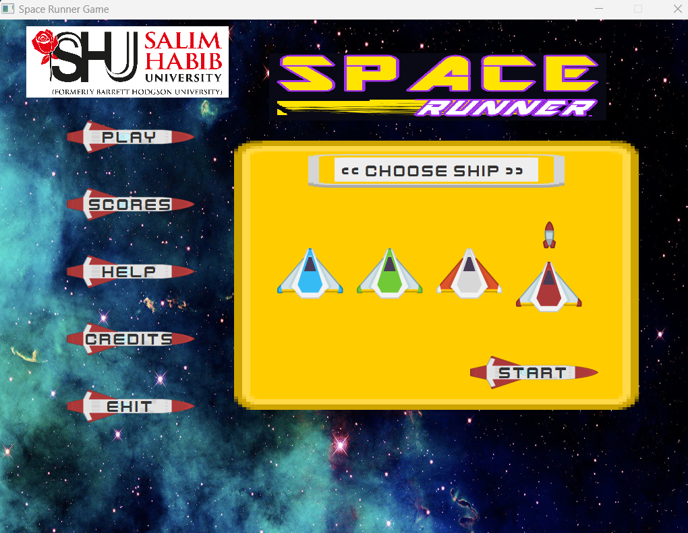
  
## - ❓ **Help Bar**
  
  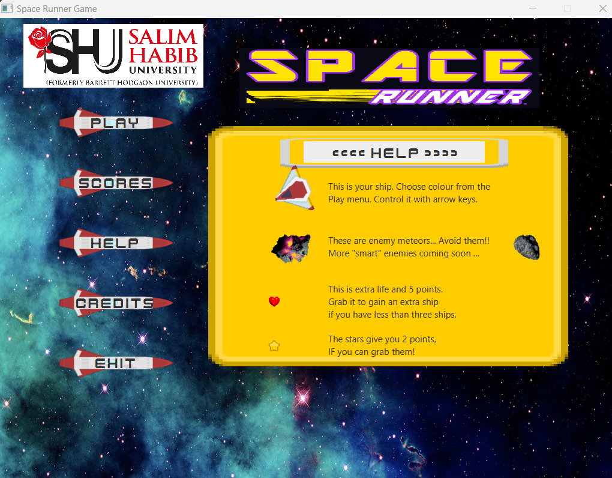

  
## - 🌌 **Gameplay**
  
  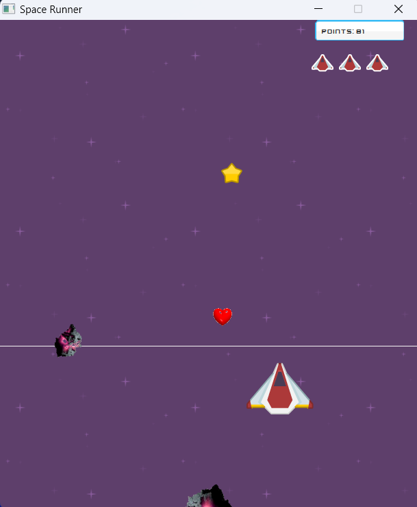  
  
  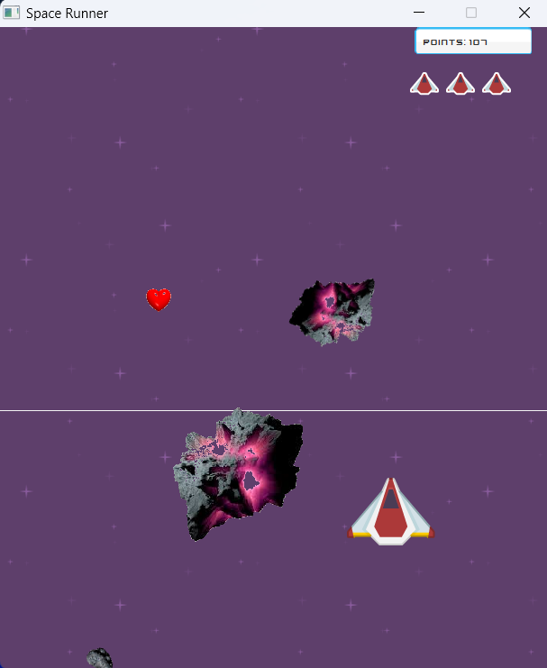  
  
  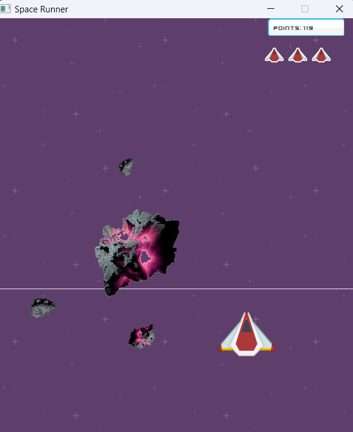  
  
  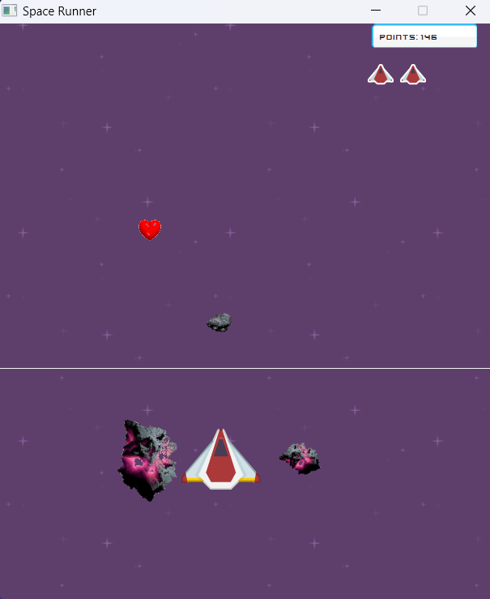
  
  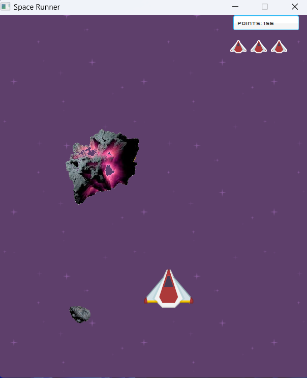  
  
  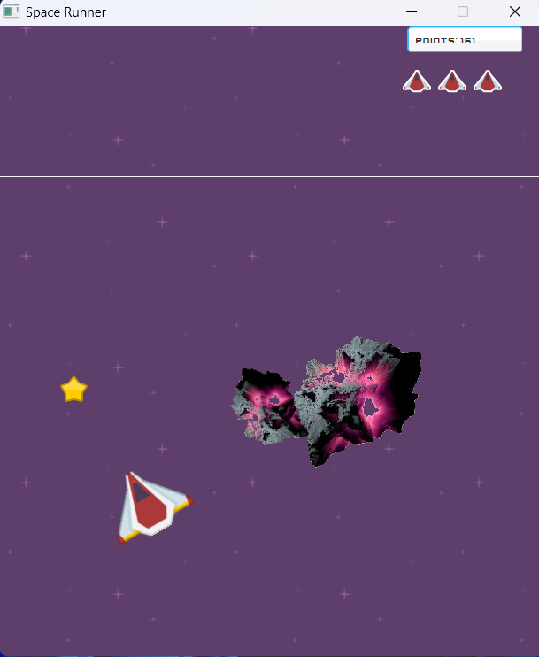  
  
  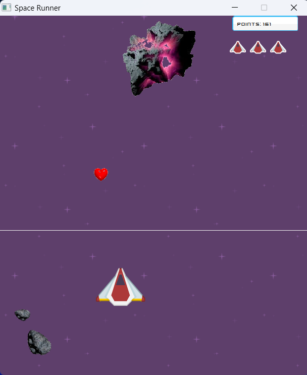  

## - 📊 **Use Case Diagram**
  
  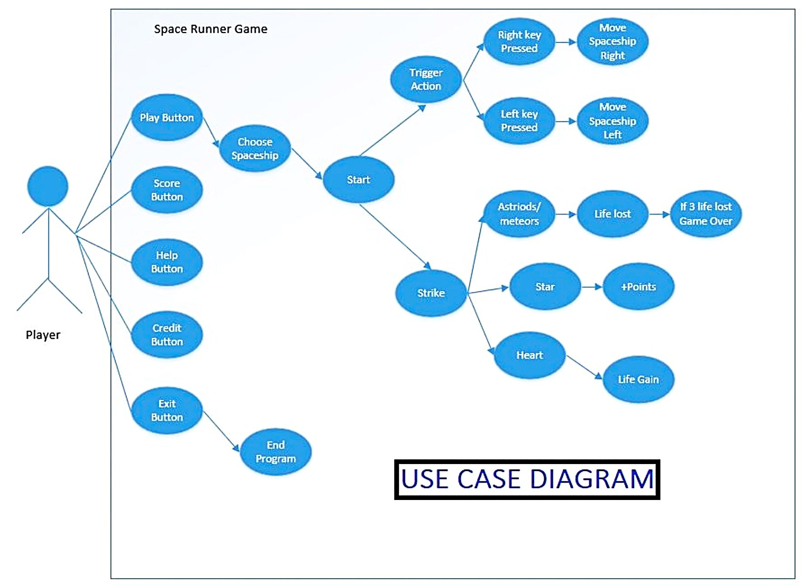
  
## - 📐 **Class Diagram**
  
  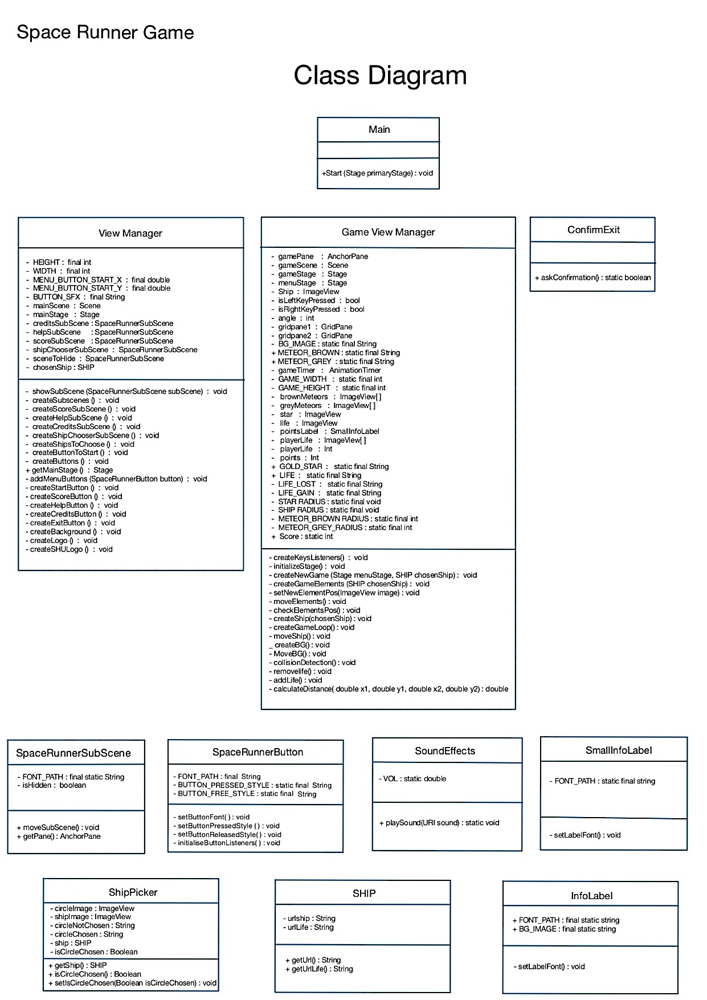  


---

## 📂 File Structure  
```
SpaceRunnerGame/ 🚀
├── bin/                              # Compiled class files
├── out/
│   └── production/
│       └── SpaceRunnerGame/            # Output directory
├── application/                       # Application logic
├── model/                             # Game models and entities
├── view/                              # User Interface and Views
│   ├── ConfirmExit.class
│   ├── GameViewManager.class
│   ├── ViewManager.class
│   └── resources/                     # UI-related resources
│       ├── SHU.png
│       ├── blue_panel.png
│       ├── buttonBlue.png
│       ├── cursor.png
│       ├── heart.png
│       ├── index1.png
│       ├── index2.png
│       ├── missile.png
│       ├── purple.png
│       ├── retina.jpg
│       ├── space_runner.jpg
│       ├── star_gold.png
│       ├── stars.jpg
│       ├── yellow_button06.png
│       ├── shipchooser/
│           ├── playerLife_blue.png
│           ├── playerLife_green.png
│           ├── playerLife_orange.png
│           └── playerLife_red.png
│       └── ships/
│           ├── ship_1.png
│           ├── ship_2.png
│           ├── ship_3.png
│           └── ship_4.png
├── resources/                        # Global resources
│   ├── grey_circle.png
│   ├── kenvector_future.ttf
│   ├── life-gain.wav
│   ├── life-lost.wav
│   ├── missile.png
│   ├── robotSFX.wav
│   ├── rocketButton.png
│   ├── yellow_boxTick.png
│   ├── yellow_button.png
│   ├── yellow_button_pressed.png
│   └── yellow_panel.png
├── src/                              # Source files
├── build.fxbuild                     # JavaFX build configuration
├── highscore.dat                     # Highscore data file
└── SpaceRunnerGame.iml                # IntelliJ project file

Images/ 📸
├── screenshot_1.png
├── screenshot_2.png
├── screenshot_3.png
├── screenshot_4.png
├── screenshot_5.png
├── screenshot_6.png
├── screenshot_7.png
├── screenshot_8.png
├── screenshot_9.png
├── screenshot_10.png  # Poster with Title
├── screenshot_11.png  # Use Case Diagram
└── screenshot_12.png  # Class Diagram

LICENSE 📜                           # MIT License
README.md 📝                         # Game description and setup
```

---

## 📊 Project Information  
- 🕹️ **Project Title:** Space Runner Game  
- 📘 **Course:** Programming Fundamentals  
- 🏫 **University:** Salim Habib University  
- 📅 **Semester:** 1st Semester, BS Computer Science  

---

## 🚀 Future Improvements  
- 🏆 **High Score Saving** and Leaderboard.  
- 🔥 **Difficulty Levels** that increase as the game progresses.  
- 🚀 **More Spaceship Options** and Customizations.  
- 🎶 **Sound Effects** for an enhanced gameplay experience.  

---

## 🤝 Contributing  
Contributions are welcome! Feel free to open issues or submit pull requests to make the game even better.  

---

## 📜 License  
This project is licensed under the **MIT License (2025)**.  
See the LICENSE file for details.  

---

## 📧 Contact  
- **Muhammad Fahad Imdad** - [fahadimdad966@gmail.com](mailto:fahadimdad966@gmail.com)  
- [LinkedIn](https://www.linkedin.com/in/muhammad-fahad-imdad) | [GitHub](https://github.com/FahadImdad)  

---

## ⭐ Acknowledgements  
Special thanks to **Salim Habib University** and the **Programming Fundamentals** course for the opportunity to develop this project.  

---

## 🌟 Don't forget to leave a star if you like this project! ⭐  
🚀 Enjoy the Space Adventure! 🌌  
